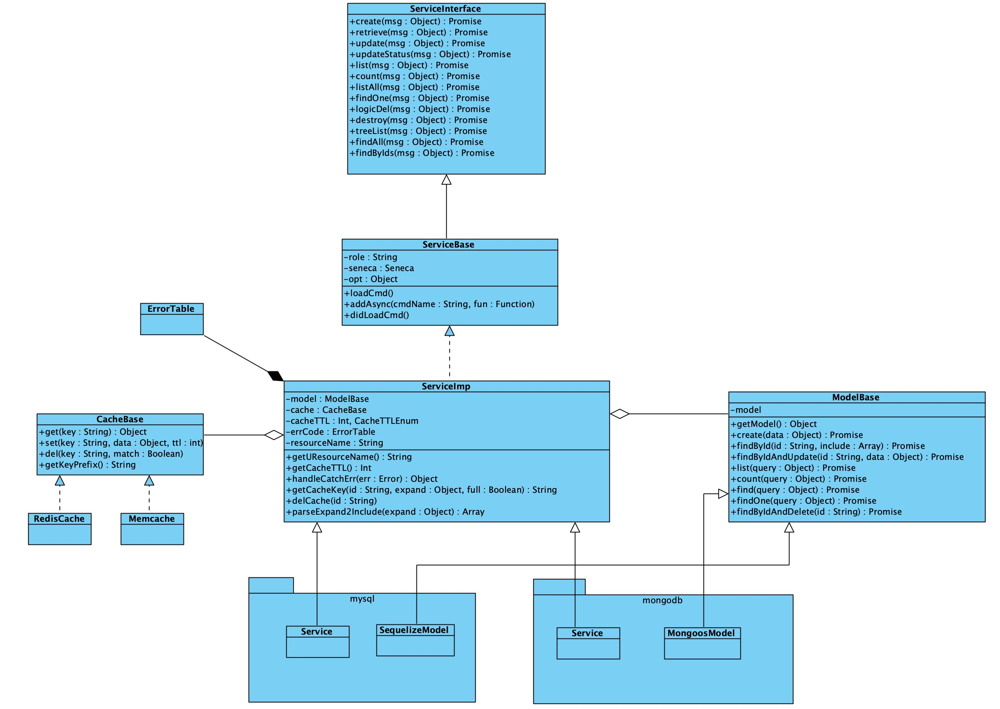

# zhz-util

通过[seneca](https://www.npmjs.com/package/seneca)提供rpc服务。

* FCClient、FCService: 封装阿里云函数计算[@alicloud/fc2
](https://www.npmjs.com/package/@alicloud/fc2)提供调用rpc api的实例
* Service: 通过[z-seneca-extended](https://www.npmjs.com/package/z-seneca-extended)提供rpc api

## Install

```shell
$ npm install zhz-util
```

## Basic Usage

```javascipt
const { util, ServiceBase, ServiceImp, mysqlSeneca, mongodbSeneca, XmlUtil, FCService, FCClient } = require('zhz-util');
```

### Seneca Service Plugs

```javascript
const { util, mysqlSeneca } = require('zhz-util');
const models = require('../../models');
const config = require('../../../config');

const model = models.Book;

module.exports = {
  init: () => Promise.resolve(),
  seneca(ctx) {
    const resourceName = 'book';
    const role = `${config.serviceName}.${resourceName}`;

    const service = new mysqlSeneca.Service({
      seneca: this,
      model: new mysqlSeneca.SequelizeModel(model),
      role,
      cache: ctx.cache,
      resourceName,
    });
    service.loadCmd();
    service.addAsync('treeList', async function (msg) {
      const { id } = msg.params;
      const data = await this.model.findById(id);
      return util.responseSuccess(data);
    });
    service.addAsync({
      async treeList1(msg) {
        const { id } = msg.params;
        const data = await this.model.findById(id);
        return util.responseSuccess(data);
      },
      async treeList2(msg) {
        const { id } = msg.params;
        const data = await this.model.findById(id);
        return util.responseSuccess(data);
      },
    });
  },
};

```

### 阿里云函数计算

```javascript
const bunyan = require('bunyan')
const moment = require('moment')
const zhzutil = require('zhz-util')

const logger = bunyan.createLogger({
  name: 'test',
  streams: [{
    level: 'info',
    path: 'test.log',
  }, {
    level: 'debug',
    stream: process.stdout,
  }],
})
const accountId = ''
const options = {
  accessKeyID: '',
  accessKeySecret: '',
  region: 'cn-shenzhen',
}

const zclient = new zhzutil.FCClient('test', 'test', {
  accountId,
  ...options,
})

zclient.actAsync({
  role: 'seneca.author',
  cmd: 'create',
}, {
  params: {
    name: Math.random().toString(),
    mobile: '13760471840',
    sex: 'MAN',
  },
}).then((ret) => {
  console.log('zclient: ', ret)
})

```

## Docs

```shell
$ pip install mkdocs
$ cd apidocs
$ modify mkdocs.yml pages to nav if you use apidocs version > 1
$ mkdocs server
```



- [util](./apidocs/docs/util.md)
- [ServiceBase](./apidocs/docs/ServiceBase.md)
- [Service](./apidocs/docs/Service.md)
- [ModelBase](./apidocs/docs/ModelBase.md)
- [FCService](./apidocs/docs/FCService.md)
- [FCClient](./apidocs/docs/FCClient.md)
