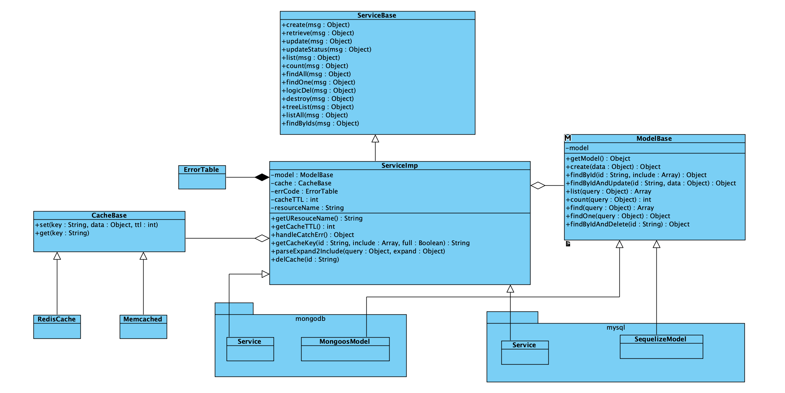

# zhz-util

通过[seneca](https://www.npmjs.com/package/seneca)提供类rpc的微服务。

* FCClient、FCService: 封装阿里云函数计算[@alicloud/fc2
](https://www.npmjs.com/package/@alicloud/fc2)提供调用类似seneca的实例
* Service: 通过[z-seneca-extended](https://www.npmjs.com/package/z-seneca-extended)提供类rpc的api

## version: 4.0.0
## Install

```shell
$ npm install zhz-util
```

## Basic Usage

```javascipt
const { util, ServiceBase, ServiceImp, mysqlSeneca, mongodbSeneca, XmlUtil, FCService, FCClient } = require('zhz-util');
```

### seneca service plugs

```javascript
const { util, mysqlSeneca } = require('zhz-util');
const models = require('../../models');
const config = require('../../../config');

const model = models.Book;

module.exports = {
  init: () => Promise.resolve(),
  seneca(ctx) {
    const resourceName = 'book';
    const role = `${config.serviceName}.${resourceName}`;

    const service = new mysqlSeneca.Service({
      seneca: this,
      model: new mysqlSeneca.SequelizeModel(model),
      role,
      cache: ctx.cache,
      resourceName,
    });
    service.loadCmd();
    service.addAsync('treeList', async function (msg) {
      const { id } = msg.params;
      const data = await this.model.findById(id);
      return util.responseSuccess(data);
    });
    service.addAsync({
      async treeList1(msg) {
        const { id } = msg.params;
        const data = await this.model.findById(id);
        return util.responseSuccess(data);
      },
      async treeList2(msg) {
        const { id } = msg.params;
        const data = await this.model.findById(id);
        return util.responseSuccess(data);
      },
    });
  },
};

```

### 阿里云函数计算

```javascript
const bunyan = require('bunyan')
const moment = require('moment')
const zhzutil = require('zhz-util')

const logger = bunyan.createLogger({
  name: 'test',
  streams: [{
    level: 'info',
    path: 'test.log',
  }, {
    level: 'debug',
    stream: process.stdout,
  }],
})
const accountId = ''
const options = {
  accessKeyID: '',
  accessKeySecret: '',
  region: 'cn-shenzhen',
}

const zclient = new zhzutil.FCClient('test', 'test', {
  accountId,
  ...options,
})

zclient.actAsync({
  role: 'seneca.author',
  cmd: 'create',
}, {
  params: {
    name: Math.random().toString(),
    mobile: '13760471840',
    sex: 'MAN',
  },
}).then((ret) => {
  console.log('zclient: ', ret)
})

```

## Docs

```shell
$ pip install mkdocs
$ cd apidocs
$ mkdocs server
```



- [util](./util)
- [ServiceBase](./ServiceBase)
- [Service](./Service)
- [ModelBase](./ModelBase)
- [FCService](./FCService)
- [FCClient](./FCClient)

## API约束

api的入参和出参统一采用json格式。api返回的JSON对象格式如下：

```javascript
{
  code: 0,
  message: '',
  status: 200,
  data: {},
}
```

|参数|类型|必填|默认值|描述|
|--- | --- | --- | --- | ---|
|code | Number, String | 是 | 无 | 0表示api调用成功，否则表示失败|
|message | String | 是 | 无 | code=0为success；否则为错误描述|
|data | Object, Array | 否 | 无 | api数据的返回值|
|status | Int | 否 | 无 | 为http状态码，兼容restfule api用|

## API 说明

继承[ServiceImp、mysqlSeneca.Service、mongodbSeneca.Service](./Service)的类，会默认为生成api：`create`、`retrieve`、`update`、`updateStatus`、`list`、`count`、`listAll`、`findOne`、`desctroy`、`findAll`、`findByIds`。自定义api时请通过`addAsync`添加

## 资源list api格式

* 分页。参数`page`表示获取第几页,默认为`1`。`pageSize`表示获取当前页的数据条.数默认为`10`。
* 排序。支持四种格式：array of `{ field: "", order: "DESC" }`；array of `[field, "DESC"]`；object of `{a: -1("DESC"), b: 1("ASC")}`；`sort=-a,b`。例如按创建时间倒序`-createdAt`。
* 关键字查找。`search` 用于查找需要模糊匹配。例如在商品列表中，当`search=可乐`，我们将搜索商品中名称或品牌为可乐的商品。
* 范围查找。范围查找采用数学的范围表达方式 `[` 表示大于等于；`]` 表示小于等于；`(` 表示大于；`)` 表示小于；`{a,b,c...}`表示`in`查询；`!{a,b,c...}!`表示`not in`查询。例如查找库存数量大于等于100，小于200的商品数量，格式为`depotQty=[100,200)`。时间为`[YYYY-MM-DD HH:mm:ss,YYYY-MM-DD HH:mm:ss]`
* 扩展数据。`expand`拿资源相关的扩展数据时，在expand指明需要获取的扩展数据。例如列表员工数据，此时需要获取部门数据：`expand=depantment`，多个扩展数据使用逗号隔开。

### list api 参数

|参数|类型|必填|默认值|描述|
|--- | --- | --- | --- | ---|
|pageSize | Int | 否 | 1 | 每页条数|
|page | Int | 否 | 10 | 当前页数|
|limit | Int | 否 | 10 | 同pageSize|
|offset | Int | 否 | 无 | 起始条数|
|sort | Array，Object, String | 否 | 无 | 排序。支持三种格式：array of { field: "", order: "DESC" }；array of [[field, "DESC"]]；object of {a: -1("DESC"), b: 1("ASC")}；sort=-a,b|
|search | String | 否 | 无 | 搜索关键字|
|expand | String | 否 | 无 | 获取指定子资源数据，多个子资源使用逗号隔开。例如：expand=a,b|

### list api 返回值

|参数|类型|必填|默认值|描述|
|--- | --- | --- | --- | ---|
|pageSize | Int | 是 | 无 | 每页条数|
|page | Int | 是 | 无 | 当前页数|
|total | Int | 是 | 无 | 符合条件的总数量|
|limit | Int | 是 | 无 | 同pageSize|
|offset | Int | 是 | 无 | 起始条数|
|items | Array | 否 | 无 | 返回数据项|
